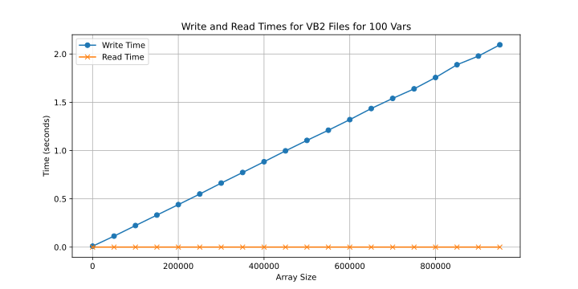
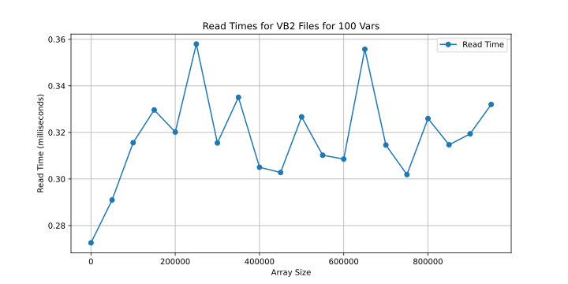

# Simple Column Wise Variable Logger

Tracks static variable pointers for a defined time and saves it to a file. 

## How to download

```bash
git clone https://github.com/philipdavis82/azzex
```

## How to test

### Simple 

```bash
make 
./test_vb2
python3 py/vb2_reader.py
```

### Extra

```bash
make LENGTH=<record_length(int)>  EXTRA_VARS=<more_variables(int)>
./test_vbs
python3 py/vb2_reader.py
```

* Defaults:
* Length=100
* EXTRA_VARS=0


## How to add to another codebase:

Add `src/var_buffer_2.c` and `include/var_buffer_2.h` to your project and make file and build system.

## Performance 

Quick performance testing. Done in the wsl2 vm. Should be faster in native os.

### Read/Write Time



### Read Only Time




